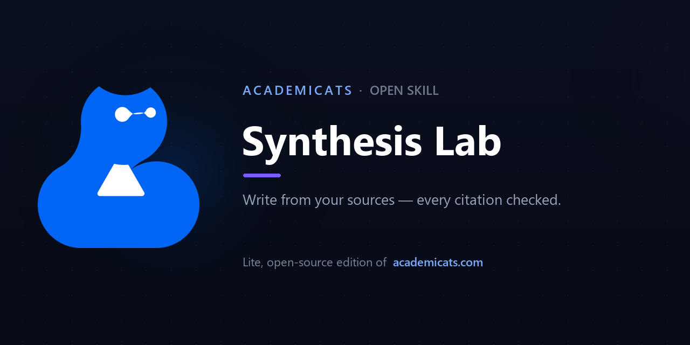

<div align="center">

**English** · [中文](README.zh-CN.md)



<br>

# 🐱 Synthesis Lab · 文献写作台

**Turn your sources into polished academic writing — literature reviews, proposals, essays, statements of purpose, résumés. Every citation traced to a real paper and verified before you ever see it.**

把你的文献变成专业的学术写作——综述、研究计划、文书、简历。**每条引用都追溯到真实论文，并在交付前核验。**

<br>

[](LICENSE)
&nbsp;[](https://claude.com/claude-code)
&nbsp;[](https://academicats.com)

</div>

---

> ### 🪶 This is the **lite, open-source edition** of [**AcademiCats**](https://academicats.com)
> The full product at **[academicats.com](https://academicats.com)** is an AI research workbench that takes you from *finding* papers through *reading, writing, and self-review* — with saved projects, live citation tooling, a polished editor, and a multi-agent reviewer. This skill is a free, self-contained slice of the writing workflow you can run on your own Claude.
>
> 这是 [**AcademiCats**](https://academicats.com) 的**开源轻量版**。完整产品在 **academicats.com**——一个从找文献到读、写、自审的 AI 研究工作台。

---

## ✨ What it does

✍️ **Writes from *your* sources** — give it a handful of papers and your core argument; it plans, drafts, reviews, and polishes a coherent piece across **ten document types**, from literature reviews to PhD statements of purpose to résumés.

🔗 **Citations you can trust** — it cites *only* the papers you supply, uses a specific number or quote *only* when it appears in the source, and cross-checks every in-text citation against your pool before delivering. No invented authors, years, or findings.

🧭 **It curates, not just writes** — papers that don't actually fit your thesis get set aside with a reason, instead of being shoehorned in to look thorough.

<br>

## 🎬 Demo

> *"Write a short literature review arguing that spaced repetition improves long-term retention, using these three papers."*  — then paste Cepeda et al. (2006), Karpicke & Roediger (2008), Kornell (2009).

A grounded excerpt of what comes back:

> A robust body of cognitive research supports the claim that spaced repetition improves long-term retention. The most comprehensive evidence comes from **Cepeda, Pashler, Vul, Wixted, and Rohrer (2006)**, whose synthesis of 317 experiments found that distributed practice reliably outperformed massed practice, with the advantage *growing as the retention interval lengthened*… Why spacing yields these gains is illuminated by work on retrieval: **Karpicke and Roediger (2008)** showed that repeatedly retrieving information produced large gains one week later…

🔎 **The honesty test it passes:** Karpicke & Roediger is about *retrieval*, not *spacing* — so it is cited only for the retrieval mechanism, and the link to spacing is framed as synthesis, **not miscredited as that paper's finding.** That discipline is the whole point.

<br>

## 🚀 Get started in 60 seconds

```bash
# drop this skill where Claude Code can find it — no dependencies, no setup
cp -r Cat_synthesis_lab ~/.claude/skills/synthesis-lab
```

Then just talk to Claude: *"help me write the lit review for my thesis arguing X, using these papers …"* or *"turn my experience into a statement of purpose for a CS PhD."* The skill triggers itself and runs entirely on your own Claude.

<br>

## 💙 Ten things it can write

Literature review · Theoretical framework · Research proposal · Introduction · Discussion · Conclusion · Abstract · Academic essay · **Personal statement / SoP** · **Résumé / CV**

|  | Synthesis Lab (this skill) | [AcademiCats full product →](https://academicats.com) |
|---|:---:|:---:|
| Grounded writing, verified citations | ✅ | ✅ |
| Built-in paper search & deep read | bring your own | ✅ end-to-end |
| Saved projects & live citation manager | — | ✅ |
| Multi-agent peer review of your draft | — | ✅ Paper Review |

<div align="center">
<br>

### Want the whole research workflow?
**→ [academicats.com](https://academicats.com) ←**

<br>

Made with 💙 by the [AcademiCats](https://academicats.com) team · [MIT License](LICENSE)

</div>
